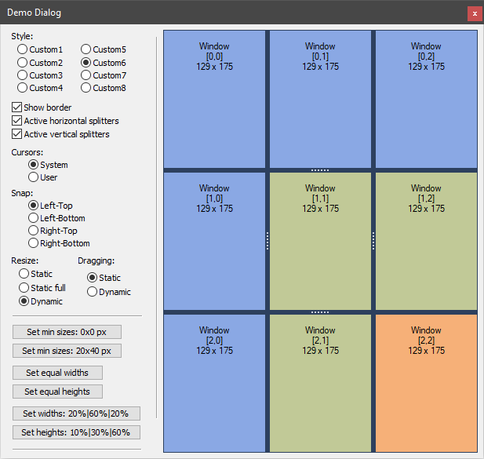

# SplitterCtrl



## Introduction

This control is necessary for the partition of the dialog, main or child window of your program by several parts. You can appropriate to each part the window, which `SplitterCtrl` will manage. As a result, we will get a matrix with the controls. The `SplitterCtrl` is derived from `CWnd` and is a common control based on MFC. Generally, `SplitterCtrl` is similar to `CSplitterWnd`, but it is easier to use. For example, you can create a complex matrix. For this into one or several cells, it is necessary to put the `SplitterCtrl` and also to divide on parts.

Also, the binding of a matrix to one of four angles of the parental window is possible. And you can use a mouse for the dynamic or static pulling of boundaries between the windows and more.

## Using the Code

The control includes classes:

| Class | Description |
| ------ | ------ |
| `SplitterCtrl`          | Includes all the base functionality, but it does not draw itself. |
| `SplitterCtrl::IRecalc` | This class makes it possible to assign sizes of parts of the control. For using be inherited from `SplitterCtrl::IRecalc` and realize its functions. Also in constructor of your class, it is necessary to call the `SplitterCtrl::SetRecalcManager` function with pointer of `SplitterCtrl::IRecalc` object. |
| `SplitterCtrl::Draw`    | This class makes it possible to draw the control. You can draw your window yourself. For this be inherited from `SplitterCtrl::Draw` and realize its functions. Also in constructor of your class, it is necessary to call the `SplitterCtrl::SetDrawManager` function with pointer of `SplitterCtrl::Draw` object. |

To create the control and add elements to it, do the following:

```cpp
#include "SplitterCtrl.h"

SplitterCtrlEx<SplitterCtrlStyle1> m_Splitter;
CListCtrl m_List1, m_List2;
   …
   …
if( !m_Splitter.Create(this, WS_CHILD | WS_VISIBLE, CRect(0,0,200,200), ID_SplitterCtrl) )
   return -1;   // error.

// Create child controls.
if( !m_List1.Create(WS_CHILD | WS_VISIBLE | WS_CLIPCHILDREN | LVS_REPORT, CRect(0,0,0,0),
   &m_Splitter, ID_List1) ||
   !m_List2.Create(WS_CHILD | WS_VISIBLE | WS_CLIPCHILDREN | LVS_REPORT, CRect(0,0,0,0),
   &m_Splitter, ID_List2) )
   return -1;   // error.
m_List1.InsertColumn(0,"00",LVCFMT_LEFT,100);
m_List2.InsertColumn(0,"01",LVCFMT_LEFT,100);

// Add child items in the m_Splitter.
m_Splitter.AddRow();
m_Splitter.AddColumn();
m_Splitter.AddColumn();
m_Splitter.SetWindow(0,0,m_List1.m_hWnd);
m_Splitter.SetWindow(0,1,m_List2.m_hWnd);

// Load state from registry.
if( !m_Splitter.LoadState(AfxGetApp(),"SplitterCtrl","SplitterState") )
{  m_Splitter.Update();   // !!!
   m_Splitter.SetColumnsEqualWidth();   // error -> create default state.
}
m_Splitter.Update();
````

You can manage the control as a normal matrix, dynamically insert and delete rows and columns (`AddRow`/`AddColumn`, `InsertRow`/`InsertColumn`, `DeleteRow`/`DeleteColumn`). The control makes it possible to assign the sizes (`SetColumnWidthForStatic`/`SetRowHeightForStatic`, `SetColumnWidthForDynamic`/`SetRowHeightForDynamic`), and also to equalize widths and heights of the cells (`SetColumnsEqualWidth`/`SetRowsEqualHeight`). The control is expected to call the `Update` function to show the results that are set by functions `InsertRow`, `DeleteColumn`, `SetRowHeightForStatic`, `SetColumnWidthsForDynamic`, etc. Also, you can save and load state of the control from the registry or other sources (`LoadState`/`SaveState`). To know all the possibilities, look at the opened interface of the `SplitterCtrl` class.

Good luck! :-)
